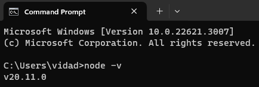

## 💾 Instalation on link: [node.org](https://nodejs.org/en/download)
* ### Choose the operating system, download LTS and install following the standard options.
 

--
* ### Installation Verification via Command Prompt

---
### [🏠 home](../Readme.md)
